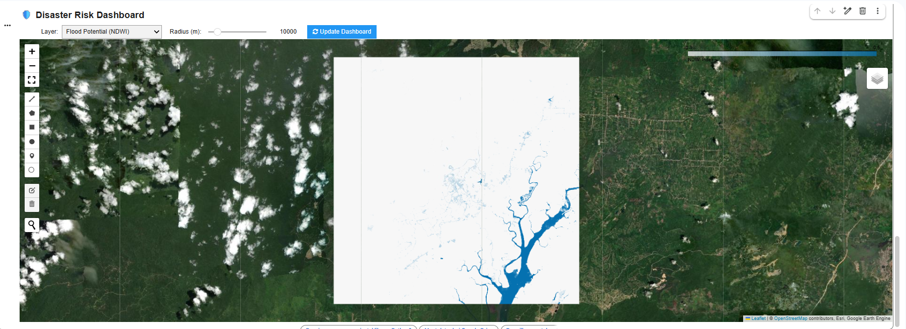
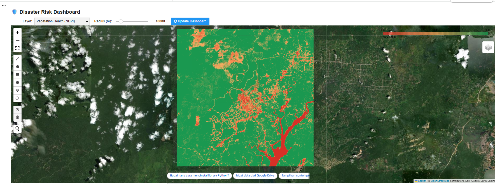

# Disaster Risk Monitoring Dashboard

Interactive WebGIS dashboard for monitoring flood potential and vegetation health using Sentinel-2 imagery processed through Google Earth Engine.

## Overview

This project demonstrates spatial analysis for disaster risk monitoring, including:

- Flood Potential Mapping (NDWI)
- Vegetation Health Monitoring (NDVI)
- Cloud masking using Sentinel-2 QA60 band
- Adjustable spatial buffer analysis

The dashboard prototype is inspired by hazard monitoring systems such as InaRISK.

## Technologies

- Python  
- Google Earth Engine API  
- Geemap  
- IPyWidgets  

## Data Source

- Sentinel-2 Surface Reflectance (COPERNICUS/S2_SR_HARMONIZED)

## Preview

### Flood Potential (NDWI)

### Vegetation Health (NDVI)

## Author

**A'laa Darojah**  
GIS Engineer | Remote Sensing | Spatial Analysis
